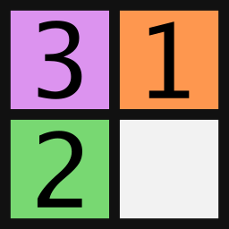
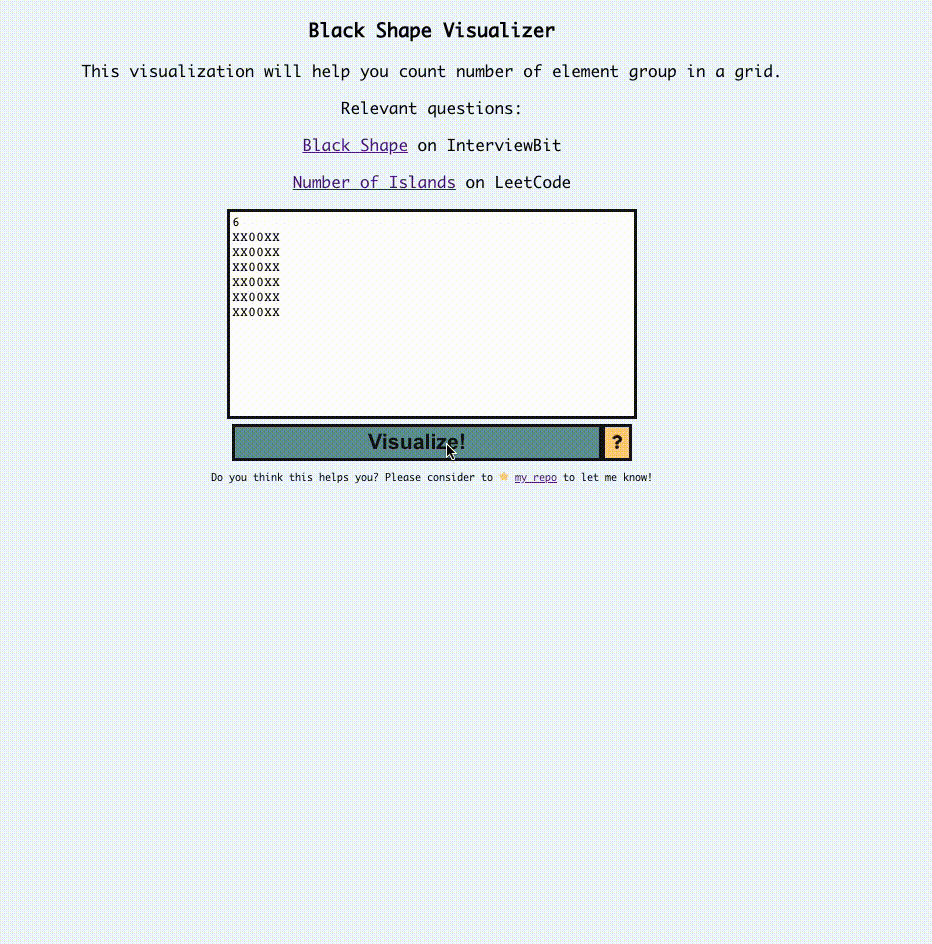

# Black Shape Visualizer

Black Shape visualizer helps you to recognize elements in groups if they are a direct neighbor (top, bottom, left, right). Helps you to solve these interview problems:
- [Black Shape](https://www.interviewbit.com/problems/black-shapes/) on InterviewBit
- [Number of Islands](https://leetcode.com/problems/number-of-islands/) on LeetCode

Test it out in [Netlify.](https://black-shape-visualizer.netlify.app/)

Hope it helps you!

Feedback and PR are always welcomed :clap:! 

(Note: reading the code probably would tell you how to solve the problem in Javascript :wink:)